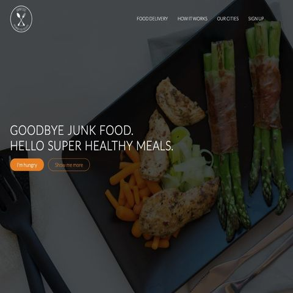

## Connect with me

    
    

## Projects

<table>
    <tr>
        <td width="50%">
            <h3>Omnifood</h3>
            
 
                <strong> Tech Used: </strong> HTML, CSS, and JavaScript  
                <strong> Purpose: </strong> Omnifood is a fully responsive website that is advertised as a food delivery service. The purpose of it is to sell the costumer this service with healthy food options.  
                 <strong> Links: </strong> <a target="_blank" href="https://davon286.github.io/Omnifood/">Website</a> // <a target="_blank" href="https://github.com/davon286/Omnifood">Repo</a> 
            

            
        </td>
        <td width="50%">
            <h3>Acme</h3>
            
 
                <strong> Tech Used: </strong> HTML, CSS  
                <strong> Purpose: </strong>Acme is a fully responsive website sample website that sells web services to a customer.  
                 <strong> Links: </strong> <a target="_blank" href="https://davon286.github.io/amce-web-design/index.html">Website</a> // <a target="_blank" href="https://github.com/davon286/Omnifood">Repo</a> 
            

            
        </td>
    </tr>
    <tr>
         <td width="50%">
            <h3>Quote Generator</h3>
            
 
                <strong> Tech Used: </strong> HTML, CSS, and JavaScript  
                <strong> Purpose: </strong> Quote Generator is a fully responsive web application that uses JavaScript to generate quotes from an API at random. It also allows the user to Tweet the quotes.  
                 <strong> Links: </strong> <a target="_blank" href="https://davon286.github.io/JavaScript-Quote-Generator/">Website</a> // <a target="_blank" href="https://github.com/davon286/JavaScript-Quote-Generator">Repo</a> 
            

            
        </td>
     <td width="50%">
            <h3>Omnifood</h3>
            
 
                <strong> Tech Used: </strong> HTML, CSS, and JavaScript  
                <strong> Purpose: </strong> Omnifood is a website that is advertised as a food delivery service. The purpose of it is to sell the costumer this service with healthy food options.  
                 <strong> Links: </strong> <a target="_blank" href="https://davon286.github.io/Omnifood/">Website</a> // <a target="_blank" href="https://github.com/davon286/Omnifood">Repo</a> 
            

            
        </td>
    </tr>
</table>

<h3 align="left">Languages and Tools:</h3>

          

